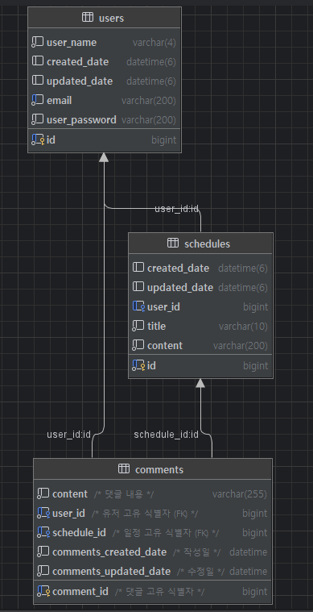

# 🗓️ 일정 관리

### 개발 전, 공통 조건
- 모든 테이블은 고유 식별자(ID)를 가집니다.
- 3 Layer Architecture에 따라 각 Layer의 목적에 맞게 개발합니다. 
- CRUD 필수 기능은 모두 데이터베이스 연결 및 `JPA`를 사용해서 개발합니다.
- 인증/인가 절차는 `Cookie/Session`을 활용하여 개발합니다. 
- JPA 연관관계는 `단방향` 입니다. 정말 필요한 경우에만 `양방향`을 적용합니다.

### <활용방법>
- 아래 API명세서 링크를 클릭해 해당 내용을 확인하면서 진행
- 유저 생성>로그인 이후 각 종 수정이나 삭제 진행(로그인 미진행시 수정,삭제 불가)
- 우선순위 유저>일정>댓글 => 유저가없으면 일정생성이 안되고 일정이 없으면 댓글기능 사용불가

### < API 명세서: 링크 첨부>
- 각 API마다 요청 혹은 응답body가 존재하는 경우 페이지 열어 json확인
- https://iodized-dumpling-d74.notion.site/_v2-API-3049211612fe805bbfdfe9faca9aba72

### < ERD >

### 구현기능
- 일정 CRUD(작성 유저명, 할일 제목, 할일 내용, 작성일, 수정일)
- 유저 CRUD(유저명, 이메일, 작성일, 수정일)
- 로그인 인증 및 비밀번호 암호화
- 필요한 기능에 세션 검증하는 로직 추가
- 제목길이, 이메일 형식 등 다양한 항목에 필요한 예외처리
- 댓글 CRUD(댓글 생성,특정 일정의 전체댓글조회, 특정댓글만 조회, 댓글수정, 댓글삭제)
- 일정 페이지 조회(기본값10개씩)

### 회고
기존에 만들어본 기능에 덧붙여지는 형식에 프로젝트였다. 2일하고 절반정도에 시간을 들였지만 예상했던것 보다 속도가 더 떨어졌다.
API명세서 포맷도 완벽을 추구하려다 오히려 시간만 날리게 되었다. 결국에는 다음과 같은 순서를 가지고 진행하게되었다.
1. 요구사항파악
2. 요구사항에 필요한 지식이나 방법 고민 및 서치
3. 구현
4. 테스트
5. 디버깅
6. 예외처리 구현- 테스트 - 확인
7. 전체 로직점검
8. 불필요한 코드 제거
9. 더 나은 방법 서치 및 생각난 방법으로 코드 재수정
10. 테스트
11. 디버깅
12. API 명세서 작성 

맞는 순서인지도 방법인지도 모르지만 한번에 모든걸 처리할 수 없다 판단하여 코드확인,기능구현,테스트, 문서 작성 측면에서 조금씩 진행하였다.
구현한게 오류가 없다면 참 좋았겠지만 명세서 작성하며 테스트 하는 과정에서 오류가 제일 많이 났던것 같다.
같은 요구사항을 봐도 사람마다 다르게 해석하여 수많은 방식에 코드가 나왔을 거라 생각한다.
정답에 가까운 코드가 있을 것이다 생각하고 구현하기 보다는 조금씩 나아가는 방법이 최선이라는 생각이 든 프로젝트였다.