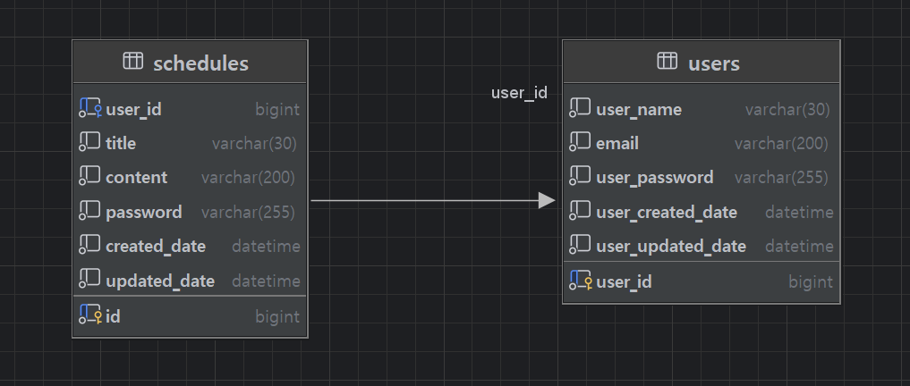

# 🗓️ 일정 관리

### 개발 전, 공통 조건

<aside>

- 모든 테이블은 고유 식별자(ID)를 가집니다.
- `3 Layer Architecture` 에 따라 각 Layer의 목적에 맞게 개발합니다.
- CRUD 필수 기능은 모두 데이터베이스 연결 및 `JPA`를 사용해서 개발합니다.
- 인증/인가 절차는 `Cookie/Session`을 활용하여 개발합니다.
- JPA 연관관계는 `단방향` 입니다. 정말 필요한 경우에만 `양방향`을 적용합니다.
</aside>

### < API 명세서: 링크 첨부>
https://iodized-dumpling-d74.notion.site/_v2-API-3049211612fe805bbfdfe9faca9aba72

### < ERD >

### 구현기능
- 일정 CRUD(작성 유저명, 할일 제목, 할일 내용, 작성일, 수정일)
- 유저 CRUD(유저명, 이메일, 작성일, 수정일)
- 로그인 인증 및 비밀번호 암호화
- 필요한 기능에 세션 검증하는 로직 추가
- 제목길이, 이메일 형식 등 다양한 항목에 필요한 예외처리